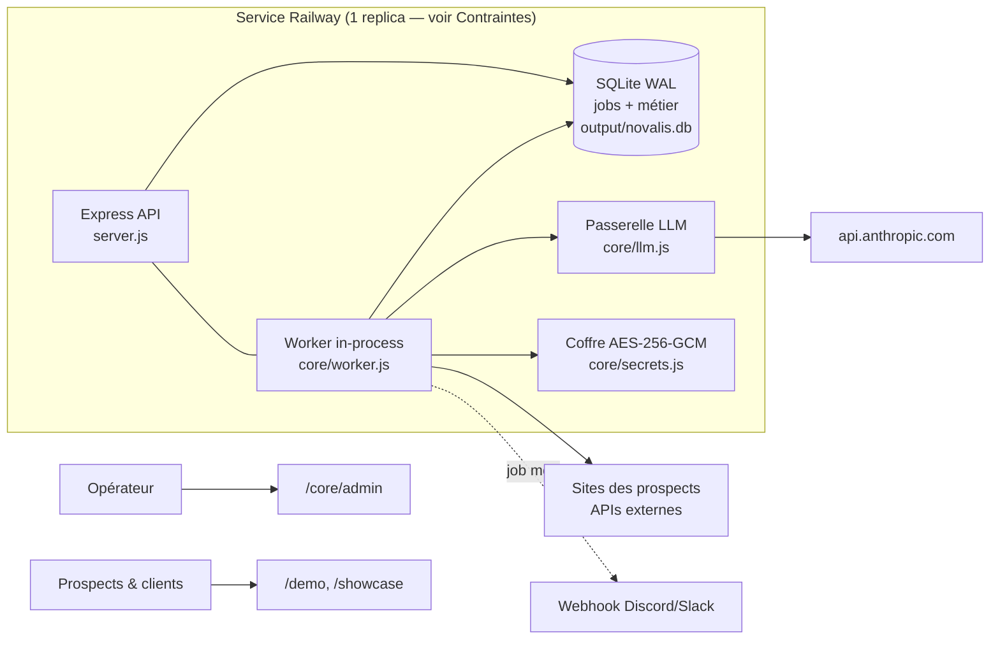

# Novalis

Agence d'IA et d'automatisation pour PME québécoises. Ce dépôt contient :

1. **La vitrine commerciale** — générateur de sites démo cinématiques
   (`showcase/`, `generate.js`, templates par secteur) utilisés comme outil
   de vente auprès des prospects.
2. **Le noyau d'automatisation** (`core/`) — file de jobs asynchrones,
   coffre à credentials chiffré, passerelle LLM avec comptage des coûts
   par client, page d'exploitation.

Production : [novalisia.ca](https://novalisia.ca) — Railway, déploiement
automatique à chaque push sur `main`.

## Architecture



**Décisions structurantes** (validées, ne pas « améliorer » sans relire ceci) :

- **Monolithe modulaire, pas de microservices.** Un seul service à opérer.
- **SQLite, pas de Postgres/Redis.** La file de jobs vit dans la même base
  que le métier : un step qui écrit un résultat ET avance le job est une
  seule transaction. À l'échelle visée (<10 clients, exécutions batch),
  SQLite a trois ordres de grandeur de marge.
- **Signaux de sortie** : >50 clients, besoin temps réel, ou file en retard
  chronique → migrer la queue vers pg-boss/Postgres, pas avant.
- **Worker in-process, concurrence 1.** sharp et Playwright sont lourds ;
  deux jobs simultanés sur une petite instance = OOM.
- **L'envoi d'outreach est volontairement manuel.** Le pipeline s'arrête au
  dossier de vente ; un humain relit la démo avant tout contact prospect.

## Contraintes d'exploitation (à lire avant de toucher à l'infra)

- **UN SEUL replica Railway, jamais deux.** La file SQLite, les rate
  limiters en mémoire et les imports au démarrage supposent un processus
  unique. Deux replicas = jobs exécutés en double (courriels envoyés deux
  fois, appels IA payés deux fois).
- `output/` est le volume persistant : base de données, photos et vidéos
  importées. Le reste du conteneur est jetable à chaque déploiement.
- Les fichiers `.db`/`.sqlite`/cachés sont bloqués par un garde-fou avant
  le middleware statique de `/demo` (`server.js`). Ne pas le retirer.

## Variables d'environnement (Railway → Variables)

| Variable | Rôle | Sans elle |
|---|---|---|
| `ADMIN_PASS` | Auth des endpoints admin et `/core/*` | ⚠️ retombe sur un défaut public — à définir absolument |
| `MASTER_KEY` | Clé maître du coffre (64 hex) | Le coffre refuse de fonctionner (fail-closed) |
| `ANTHROPIC_API_KEY` | Passerelle LLM | Les appels IA échouent avec un message clair |
| `ALERT_WEBHOOK_URL` | Alertes Discord/Slack (job mort) | Alertes visibles seulement dans les logs |
| `UNSPLASH_KEY` / `PEXELS_KEY` | Recherche photo par API | Fallback sur les URLs curées |

Générer une `MASTER_KEY` :
`node -e "console.log(require('crypto').randomBytes(32).toString('hex'))"`

## Exploitation quotidienne

- **Page d'exploitation** : `https://novalisia.ca/core/admin?pass=…` —
  lancer un pipeline, voir les runs et leurs steps, relancer un job mort,
  suivre les coûts IA du mois par client.
- **Santé** : `GET /core/health` → `{ok, queued, running, dead, oldest_queued}`.
  Brancher sur un moniteur gratuit (UptimeRobot) pointé sur cette URL.
- **Pipelines disponibles** :
  - `audit-prospect` — audit du site d'une PME (title, meta, schema.org,
    téléphone cliquable, viewport, alt) → rapport scoré.
  - `demo-prospect` — audit + extraction (nom, téléphone, couleur de
    marque) + génération du site démo → dossier de vente complet.

## Runbooks

### Un job est « dead » (alerte reçue)
1. Ouvrir `/core/admin`, cliquer **Steps** sur le job → identifier le step
   et l'erreur exacte.
2. Cause transitoire (site du prospect down, API 500) → bouton
   **Relancer** : le run reprend au step échoué, les steps réussis ne sont
   pas rejoués (ni repayés).
3. Cause durable (URL invalide, secteur manquant) → relancer un nouveau
   job avec le bon payload ; le mort reste comme trace.

### Le site est lent / les photos ne chargent pas
1. `GET /ltc-import-status` et `/ltc-video-status` — vérifier les tailles.
2. Une image > 1,5 Mo indique que la recompression n'a pas tourné :
   redéployer (elle s'exécute après les imports au démarrage).
3. Diagnostic visuel du site en production sans accès direct : committer
   une modification de `.site-check-trigger` → le workflow GitHub Actions
   `site-check` capture le site réel et publie tout dans la branche
   `site-checks` (`git fetch origin site-checks` puis `git archive`).

### Rotation de la MASTER_KEY (clé compromise ou par hygiène)
1. Générer une nouvelle clé (commande ci-dessus).
2. Sur une console Node du serveur :
   `require('./core/secrets').createVault(db, ANCIENNE).rotateMasterKey(ANCIENNE, NOUVELLE)`
   — re-wrap les DEK par client, les credentials ne sont pas retouchés.
3. Mettre à jour `MASTER_KEY` dans Railway → redéploiement automatique.

### Restauration après perte du volume
⚠️ **Pas encore automatisé** (Litestream → Cloudflare R2 prévu, non
configuré). Aujourd'hui : les démos se régénèrent via les pipelines, les
photos/vidéos se ré-importent seules au démarrage, mais **les données de
la base (prospects, runs, credentials) seraient perdues**. Priorité si les
données deviennent précieuses : créer un bucket R2 gratuit + sidecar
Litestream dans le Dockerfile.

### Le déploiement Railway échoue
1. Railway → Deployments → logs du build.
2. `node --check server.js` et `npm test` passent en CI à chaque push —
   si CI est vert mais le déploiement échoue, c'est presque toujours une
   dépendance native (sharp, better-sqlite3) : vérifier la version Node du
   build Railway (20+).

## Développement

```bash
npm install
npm test          # vitest — file de jobs, coffre chiffré (17 tests)
npm run lint      # eslint — core/ et tests/ uniquement (legacy exclu)
node server.js    # http://localhost:3000
```

Le noyau (`core/`) est la seule zone avec exigence de qualité stricte
(tests + lint en CI). Le legacy (`server.js` racine, `main.py`) se
nettoie au fur et à mesure qu'on le touche — stratégie strangler,
jamais de réécriture big-bang.

## API du noyau (résumé)

Tous les endpoints `/core/*` exigent `x-admin-pass` (ou `?pass=`).

| Méthode | Route | Rôle |
|---|---|---|
| POST | `/core/enqueue` | `{type, clientId, payload, dedupeKey?, priority?}` → 202 `{id}` |
| GET | `/core/runs?limit=` | Runs récents (payload/output parsés) |
| GET | `/core/runs/:id` | Timeline des steps du run |
| POST | `/core/runs/:id/requeue` | Relance un job dead/failed |
| GET | `/core/costs` | Coûts/tokens LLM du mois par client |
| POST | `/core/credentials` | `{clientId, name, value}` — écrire un secret client |
| GET | `/core/credentials/:clientId` | Noms des secrets (jamais les valeurs) |
| GET | `/core/health` | État de la file (public, sans auth) |
